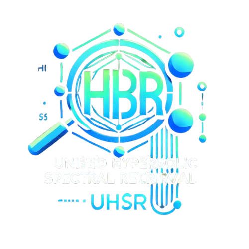

<div align="center">
  
  <hr>
  <br/>
</div>

# Unified Hyperbolic Spectral Retrieval (UHSR)

Unified Hyperbolic Spectral Retrieval (UHSR) is a novel text retrieval algorithm that fuses lexical search (using BM25) with semantic search (using dense embeddings) into a unified, robust, and scalable system. UHSR employs advanced techniques such as logistic normalization, harmonic fusion, and spectral re-ranking based on graph Laplacian analysis to generate interpretable relevance scores in the [0,1] range. It supports multiple similarity metrics—cosine, euclidean, and Mahalanobis—ensuring flexibility and adaptability across diverse datasets.

[](https://www.python.org/downloads/)
[](https://pypi.org/project/uhsr/0.1.0/)
[](https://github.com/vedaant00/uhsr/blob/main/LICENSE)


## What is UHSR?

UHSR is a unified text retrieval framework that effectively combines:
- **Lexical Search:** Utilizes BM25 to capture exact keyword relevance.
- **Semantic Search:** Leverages dense embeddings and user-selectable similarity metrics (cosine, euclidean, or Mahalanobis) to capture contextual meaning.
- **Advanced Fusion Techniques:** Applies logistic normalization and harmonic fusion to merge BM25 and semantic scores.
- **Spectral Re-Ranking:** Uses spectral analysis (via the graph Laplacian and Fiedler vector) to re-rank candidates based on their centrality, ensuring robust and interpretable relevance scores.

## Main Features

- **Hybrid Retrieval:** Seamlessly integrates BM25 and semantic search.
- **Advanced Fusion:** Combines scores using logistic normalization and harmonic fusion.
- **Spectral Re-Ranking:** Boosts central candidates using graph Laplacian analysis.
- **Metric Flexibility:** Supports cosine, euclidean, and Mahalanobis similarity.
- **Interpretable Scoring:** Final scores are normalized to the [0,1] range.
- **Scalable:** Utilizes FAISS for fast approximate nearest neighbor search, suitable for both small and large datasets.

## Novel Contributions

- **Unified Fusion Method:** A novel combination of BM25 and semantic scores through logistic normalization and harmonic fusion.
- **Spectral Re-Ranking:** Incorporates spectral analysis to enhance candidate ranking based on centrality.
- **User-Selectable Metrics:** Offers flexibility in choosing the best similarity measure for your data.
- **End-to-End Pipeline:** Provides a complete retrieval framework that produces interpretable, normalized relevance scores.

## Installation

Clone the repository and install the required dependencies:

```bash
git clone https://github.com/vedaant00/uhsr-retrieval.git
cd uhsr-retrieval
pip install -r requirements.txt
```

*Note:* By default, the package uses `faiss-cpu`. For GPU support, install with:

```bash
pip install uhsr-retrieval[gpu]
```

## Usage

Here's an example of how to use UHSR in your Python project:

```python
from sentence_transformers import SentenceTransformer
from uhsr import UHSR
import numpy as np

# Sample dataset of documents
documents = [
    "Apple releases new iPhone",
    "Tesla's stock price surges",
    "Google announces AI updates",
    "Amazon introduces drone delivery",
    "Microsoft acquires a gaming company"
]

# Load the embedding model (e.g., all-MiniLM-L6-v2)
model = SentenceTransformer('all-MiniLM-L6-v2')

# Compute document embeddings (normalized)
embeddings = model.encode(documents, normalize_embeddings=True)

# Compute query embedding
query_embedding = model.encode(["What did Tesla announce?"], normalize_embeddings=True)[0]

# Initialize the UHSR retrieval system
retrieval_system = UHSR(documents, embeddings)

# Retrieve documents using cosine similarity (choose from 'cosine', 'euclidean', or 'mahalanobis')
retrieved_docs, scores = retrieval_system.retrieve("What did Tesla announce?", query_embedding, top_k=3, metric='cosine')

print("Retrieved Documents:")
for doc, score in zip(retrieved_docs, scores):
    print(f"{doc} (Score: {score:.4f})")
```

## Repository Structure

```
uhsr-retrieval/
├── uhsr/
│   ├── __init__.py         # Package initialization; imports from core.py
│   └── core.py             # Contains UHSR, BM25, FAISSRetrieval, and utility functions
├── examples/
│   └── example.py          # Example script demonstrating usage of UHSR
├── README.md               # This file
├── setup.py                # Packaging script for PyPI
└── requirements.txt        # List of dependencies
```

## Requirements

- numpy
- sentence-transformers
- FAISS (either `faiss-cpu` or `faiss-gpu`)

## License

This project is licensed under the MIT License.

## Contributing

Contributions, bug reports, and suggestions are welcome! Please feel free to submit issues or pull requests on GitHub.

## Getting Help

For usage questions or support, please open an issue on the [GitHub repository](https://github.com/vedaant00/uhsr-retrieval).

## Conclusion

UHSR is a novel and unified text retrieval framework that combines lexical and semantic signals through advanced normalization, fusion, and spectral re-ranking techniques. Its interpretable scoring and metric flexibility make it an innovative tool for both research and practical applications. We welcome contributions and improvements from the community!

---

*This package is intended for research and educational purposes.*