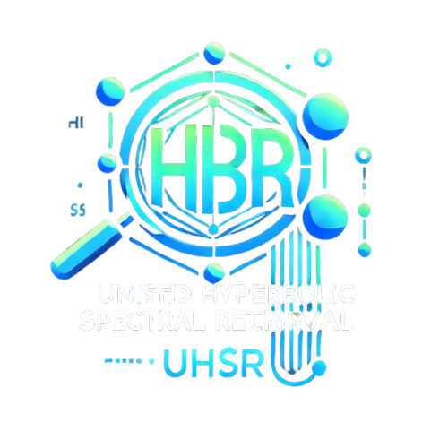

<div align="center">
  
  <hr>
  <br/>
</div>

# Unified Hyperbolic Spectral Retrieval (UHSR)

UHSR is a **next-generation hybrid text retrieval model** that seamlessly integrates **lexical search (BM25)** and **semantic search (FAISS/Pinecone)** with **spectral re-ranking** to produce **interpretable** and **normalized** relevance scores in the `[0,1]` range.

---

## ⚡ Key Highlights
- ✅ **Hybrid Search:** Combines BM25 with dense embeddings.  
- 🔍 **Custom Similarity Metrics:** Supports **cosine, euclidean, mahalanobis, manhattan, chebyshev, jaccard, and hamming**.  
- 🎯 **Spectral Re-Ranking:** Uses **Graph Laplacian & Fiedler vector** for robust ranking.  
- 📈 **Interpretable Scores:** Final scores are **logistic-normalized** in **[0,1]**.  
- 🚀 **Scalable & Efficient:** Built on **FAISS** (local) and **Pinecone** (cloud).  
- 🤖 **AI-powered Reranking:** Integrates **Hugging Face Cross-Encoders** and **OpenAI Rerankers**.

---

<p align="center">
  <a href="https://www.python.org/"></a>
</p>

<p align="center">
  
  <a href="https://pypi.org/project/uhsr"></a>
  <a href="https://pypi.org/project/uhsr"></a>
  <a href="https://github.com/vedaant00/uhsr/blob/main/LICENSE"></a>
  <br/>
  
  
</p>

---

## 🚀 What is UHSR?

UHSR unifies **lexical and semantic retrieval** into a single hybrid retrieval pipeline:

| Component | Functionality |
|------------|---------------|
| 🔹 **Lexical Search** | BM25 for keyword-based ranking |
| 🔹 **Semantic Search** | FAISS (local) or Pinecone (cloud-based) vector search |
| 🔹 **Fusion** | Logistic Normalization + Harmonic Fusion for score blending |
| 🔹 **Spectral Re-Ranking** | Graph Laplacian + Fiedler vector for centrality-based refinement |
| 🔹 **AI-based Reranking** | Hugging Face Cross-Encoder or OpenAI-based rerankers |

---

## 📌 Features
- **🔍 Multi-Metric Retrieval:** cosine, euclidean, mahalanobis, manhattan, chebyshev, jaccard, hamming  
- **🌐 Pinecone Support:** seamless cloud-based semantic search  
- **🤖 AI-Powered Reranking:** Hugging Face or OpenAI models  
- **📊 Hybrid Fusion:** BM25 + semantic scoring  
- **♾️ Normalized Scores:** interpretable `[0,1]` relevance  
- **📈 Spectral Graph Ranking:** enhances candidate ranking stability  
- **🚀 Scalable:** FAISS for fast local retrieval  

---

## 📦 Installation

### 1️⃣ Install core package
```bash
pip install uhsr[cpu]
```

### 2️⃣ (Optional) GPU acceleration
```bash
pip install uhsr[gpu]
```

### 3️⃣ (Optional) Pinecone for cloud-based retrieval
```bash
pip install pinecone-client
```

### 4️⃣ (Optional) OpenAI-based reranking
```bash
pip install openai
```

---

## ⚡ Usage Example

```python
from sentence_transformers import SentenceTransformer
from uhsr import UHSR
import numpy as np

# Sample documents
documents = [
    "Apple releases new iPhone",
    "Tesla's stock price surges",
    "Google announces AI updates",
    "Amazon introduces drone delivery",
    "Microsoft acquires a gaming company"
]

# Load embedding model
model = SentenceTransformer('all-MiniLM-L6-v2')
embeddings = model.encode(documents, normalize_embeddings=True)
query_embedding = model.encode("Did Tesla's stock price go up?", normalize_embeddings=True)

# Initialize UHSR with OpenAI Reranker
retrieval_system = UHSR(
    documents,
    embeddings,
    reranker_type="openai",
    openai_api_key="your-openai-api-key"
)

# Retrieve results
retrieved_docs, scores = retrieval_system.retrieve(
    "Did Tesla's stock price go up?",
    query_embedding,
    top_k=3,
    metric='cosine',
    rerank=True
)

for doc, score in zip(retrieved_docs, scores):
    print(f"{doc} (Score: {score:.4f})")
```

---

## 🌐 Using Pinecone for Scalable Search

```python
retrieval_system = UHSR(
    documents,
    embeddings,
    use_pinecone=True,
    pinecone_api_key="your_pinecone_api_key"
)

retrieved_docs, scores = retrieval_system.retrieve(
    "Did Tesla's stock price go up?",
    query_embedding,
    top_k=3,
    metric='cosine'
)
```

---

## 🎛️ Supported Similarity Metrics
```python
retrieved_docs, scores = retrieval_system.retrieve("query", query_embedding, metric='cosine')      # ✅ Cosine
retrieved_docs, scores = retrieval_system.retrieve("query", query_embedding, metric='euclidean')   # ✅ Euclidean
retrieved_docs, scores = retrieval_system.retrieve("query", query_embedding, metric='mahalanobis') # ✅ Mahalanobis
retrieved_docs, scores = retrieval_system.retrieve("query", query_embedding, metric='manhattan')   # ✅ Manhattan
retrieved_docs, scores = retrieval_system.retrieve("query", query_embedding, metric='chebyshev')   # ✅ Chebyshev
retrieved_docs, scores = retrieval_system.retrieve("query", query_embedding, metric='jaccard')     # ✅ Jaccard
retrieved_docs, scores = retrieval_system.retrieve("query", query_embedding, metric='hamming')     # ✅ Hamming
```

---

## 📂 Repository Structure
```
uhsr-retrieval/
├── uhsr/
│   ├── core.py             # Main retrieval logic
│   ├── bm25.py             # BM25 implementation
│   ├── faiss_retrieval.py  # FAISS backend
│   ├── vector_db.py        # Pinecone integration
│   ├── similarity.py       # Similarity metrics
│   ├── reranker.py         # AI-based reranking
│   ├── utils.py            # Utility functions
├── examples/
│   ├── example.py
├── README.md
├── setup.py
├── requirements.txt
```

---

## 🎯 Requirements
- `numpy`
- `sentence-transformers`
- `faiss-cpu` / `faiss-gpu`
- `pinecone-client`
- `openai`

---

## 🧪 Running Tests
```bash
pytest
```

---

_Learn more about UHSR on [Medium](https://vedaantsingh706.medium.com/revolutionizing-text-retrieval-with-uhsr-a-hybrid-approach-combining-lexical-semantic-spectral-6c7e28c3e7d9)._

🚀 **Try UHSR today & supercharge your search!**
