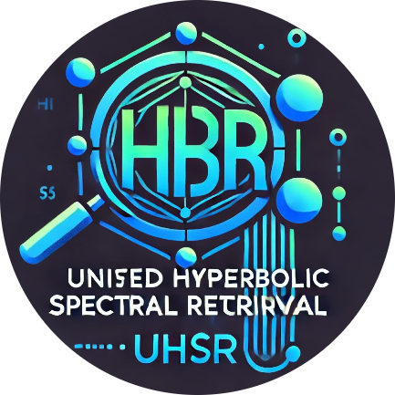

<div align="center">
  
  <hr>
  <br/>
</div>

# Unified Hyperbolic Spectral Retrieval (UHSR)

UHSR is a **next-generation hybrid text retrieval model** that seamlessly integrates **lexical search (BM25)** and **semantic search (FAISS/Pinecone)** with **spectral re-ranking** to produce **interpretable** and **normalized** relevance scores in the `[0,1]` range.

⚡ **Key Highlights:**
- ✅ **Hybrid Search:** Combines BM25 with dense embeddings.
- 🔍 **Custom Similarity Metrics:** Supports **cosine, euclidean, mahalanobis, manhattan, chebyshev, jaccard, and hamming**.
- 🎯 **Spectral Re-Ranking:** Uses **graph Laplacian & Fiedler vector** for robust ranking.
- 📈 **Interpretable Scores:** All final scores are **logistic-normalized** in **[0,1]**.
- 🚀 **Scalable & Efficient:** Supports **FAISS** for fast retrieval & **Pinecone** for cloud-based indexing.
- 🤖 **AI-powered Reranking:** Supports **Hugging Face Cross-Encoders & OpenAI API-based Reranking**.

[](https://www.python.org/)

[](https://www.python.org/downloads/release/python-360/)
[](https://pypi.org/project/uhsr)

[](https://pypi.org/project/uhsr)
[](https://github.com/vedaant00/uhsr/blob/main/LICENSE)


---

## 🚀 What is UHSR?

UHSR unifies **lexical and semantic retrieval** into a single framework:

| Component        | Functionality |
|-----------------|--------------|
| 🔹 **Lexical Search**  | **BM25** for keyword-based ranking |
| 🔹 **Semantic Search** | FAISS (local) or **Pinecone (cloud-based)** vector search |
| 🔹 **Advanced Fusion** | **Logistic Normalization + Harmonic Fusion** for score blending |
| 🔹 **Spectral Re-Ranking** | **Graph Laplacian + Fiedler vector** to boost central candidates |
| 🔹 **AI-based Reranking** | **Hugging Face Cross-Encoders or OpenAI API** for reranking |

---

## 📌 Features

- **🔍 Multiple Similarity Metrics:** `cosine`, `euclidean`, `mahalanobis`, `manhattan`, `chebyshev`, `jaccard`, `hamming`
- **🌐 Pinecone Support:** Cloud-based **semantic search at scale**
- **🤖 AI-powered Reranking:** Supports **Hugging Face Cross-Encoders & OpenAI Rerankers**
- **📊 Hybrid Retrieval:** Merges **BM25 + Semantic Scores**
- **♾️ Normalized Scores:** Interpretable `[0,1]` range  
- **📈 Spectral Graph Analysis:** **Enhances candidate ranking**  
- **🚀 Scalable:** FAISS for **fast nearest neighbor search**  

---

## 📦 Installation

### **1️⃣ Install via pip**
```bash
pip install uhsr-retrieval
```

### **2️⃣ (Optional) Enable GPU Acceleration**
```bash
pip install uhsr-retrieval[gpu]
```

### **3️⃣ (Optional) Enable Pinecone for Cloud-based Retrieval**
```bash
pip install pinecone-client
```

### **4️⃣ (Optional) Enable OpenAI Reranking**
```bash
pip install openai
```

### **5️⃣ Clone for Development**
```bash
git clone https://github.com/vedaant00/uhsr-retrieval.git
cd uhsr-retrieval
pip install -r requirements.txt
```

---

## ⚡ **Usage Example**

```python
from sentence_transformers import SentenceTransformer
from uhsr import UHSR
import numpy as np

# Sample documents
documents = [
    "Apple releases new iPhone",
    "Tesla's stock price surges",
    "Google announces AI updates",
    "Amazon introduces drone delivery",
    "Microsoft acquires a gaming company"
]

# Load embedding model (e.g., 'all-MiniLM-L6-v2')
model = SentenceTransformer('all-MiniLM-L6-v2')

# Compute document embeddings
embeddings = model.encode(documents, normalize_embeddings=True)

# Encode the query
query_embedding = model.encode("Did Tesla's stock price go up?", normalize_embeddings=True)

# Initialize UHSR with OpenAI Reranker
retrieval_system = UHSR(
    documents, 
    embeddings, 
    reranker_type="openai", 
    openai_api_key="your-openai-api-key"
)

# Retrieve using cosine similarity with reranking
retrieved_docs, scores = retrieval_system.retrieve(
    "Did Tesla's stock price go up?", 
    query_embedding, 
    top_k=3, 
    metric='cosine',
    rerank=True
)

print("Retrieved Documents:")
for doc, score in zip(retrieved_docs, scores):
    print(f"{doc} (Score: {score:.4f})")
```

---

## 🌐 **Using Pinecone for Scalable Search**

```python
retrieval_system = UHSR(
    documents, 
    embeddings, 
    use_pinecone=True, 
    pinecone_api_key="your_pinecone_api_key"
)

retrieved_docs, scores = retrieval_system.retrieve(
    "Did Tesla's stock price go up?", 
    query_embedding, 
    top_k=3, 
    metric='cosine'
)
```

---

## 🎛️ **Available Similarity Metrics**
```python
retrieved_docs, scores = retrieval_system.retrieve("query", query_embedding, metric='cosine')      # ✅ Cosine Similarity
retrieved_docs, scores = retrieval_system.retrieve("query", query_embedding, metric='euclidean')   # ✅ Euclidean Distance
retrieved_docs, scores = retrieval_system.retrieve("query", query_embedding, metric='mahalanobis') # ✅ Mahalanobis Distance
retrieved_docs, scores = retrieval_system.retrieve("query", query_embedding, metric='manhattan')   # ✅ Manhattan Distance
retrieved_docs, scores = retrieval_system.retrieve("query", query_embedding, metric='chebyshev')   # ✅ Chebyshev Distance
retrieved_docs, scores = retrieval_system.retrieve("query", query_embedding, metric='jaccard')     # ✅ Jaccard Similarity
retrieved_docs, scores = retrieval_system.retrieve("query", query_embedding, metric='hamming')     # ✅ Hamming Similarity
```

---

## 📂 **Repository Structure**
```
uhsr-retrieval/
├── uhsr/
│   ├── __init__.py         # Package initialization
│   ├── core.py             # Main retrieval logic
│   ├── bm25.py             # BM25 implementation
│   ├── faiss_retrieval.py  # FAISS vector search
│   ├── similarity.py       # Custom similarity metrics
│   ├── reranker.py         # Reranking models (HuggingFace/OpenAI)
│   ├── utils.py            # Utility functions (logistic normalization, fusion)
│   ├── vector_db.py        # Pinecone integration
├── examples/
│   ├── example.py          # Usage example
├── README.md               # Documentation
├── setup.py                # PyPI packaging script
├── requirements.txt        # Dependencies
```

---

## 🎯 **Requirements**
- `numpy`
- `sentence-transformers`
- `faiss-cpu` / `faiss-gpu` *(Optional for acceleration)*
- `pinecone-client` *(Optional for cloud-based retrieval)*
- `openai` *(Optional for OpenAI-powered reranking)*

---

_Learn More about this package on [Medium](https://vedaantsingh706.medium.com/revolutionizing-text-retrieval-with-uhsr-a-hybrid-approach-combining-lexical-semantic-spectral-6c7e28c3e7d9)._

🚀 **Try UHSR today & supercharge your search!** 🎯